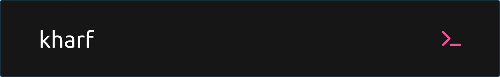

Passionate about GitOps, Cloud Native and Kubernetes.

Currently exploring Nix and Cue.

Also working on a GitOps Toolkit called "declcd", mainly for educational purposes. It is designed for Kubernetes, utilizing the power of Cue instead of YAML for configuration and I am very excited to make it public in the upoming months.

## 🌐 Socials
 

---

